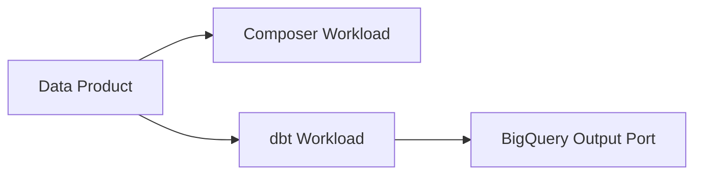

# Blueprints

## What a Blueprint Is

A Blueprint is a Witboost custom entity that bundles **one project (system) template** with the
**component templates** that make up a well-known use case, plus the order in which they should be
built. Users consume it from `Builder > Blueprints`.

A Blueprint is **not** a scaffolder template:

- no `parameters`, no `steps`, no `skeleton`, no `urn:dmb:utm:` / `urn:dmb:itm:` URNs
- it never generates code — it orchestrates templates that already exist
- it lives in a single `catalog-info.yaml` at the **root** of its repository

The formal contract is [blueprint.schema.json](./schemas/blueprint.schema.json). The annotated
reference implementation is [examples/example-blueprint/](./examples/example-blueprint/).

## Field Contract

| Field | Required | Notes |
| --- | --- | --- |
| `apiVersion` | yes | Always `agilelab.it/v1alpha1` |
| `kind` | yes | Always `Blueprint` |
| `metadata.name` | yes | Only `[a-z0-9+#]` separated by `-`. Convention: `{use-case}-blueprint` |
| `metadata.title` | no | Shown on the blueprint card |
| `metadata.description` | no | Describes the **use case**, not a technology |
| `metadata.tags` | no | Same charset rule as `metadata.name` |
| `metadata.mesh.icon` | no | Icon of the dominant technology |
| `metadata.annotations."backstage.io/techdocs-ref"` | no | `dir:.` to publish `mkdocs.yml` + `docs/` |
| `spec.mainTemplateId` | yes | Must reference a **system** template, as `template:default/{metadata.name}` |
| `spec.templates[].id` | yes | Component templates only, same reference form |
| `spec.templates[].dependencies` | no | Ids from the same `spec.templates` list |
| `spec.lifecycle` | no | `experimental` while the use case is being validated, else `production` |
| `spec.owner` | no | Entity-ref form: `group:<name>` |
| `spec.domain` | no | Entity-ref form: `domain:<name>`. Only when the whole use case belongs to one domain |
| `spec.parentRefField` | no | Picker field auto-filled with the parent system. Defaults to `dataproduct` |

Template references use `template:default/{metadata.name}` — read `metadata.name` from the target
`template.yaml`. Never use the `urn:dmb:utm:...` form here.

## Step 1: Discover the Templates

The user provides either a list of paths (one per template) or a single folder containing all of them.

- **Folder input**: recursively find every `template.yaml`. Treat the containing directory as one
  template. Skip any `catalog-info.yaml` whose `kind` is `Blueprint`.
- **Path input**: read each template directly.

Extract from each template:

| Source | Used for |
| --- | --- |
| `template.yaml` `metadata.name` | The `template:default/{name}` reference |
| `template.yaml` `metadata.title` | Preview readability |
| `template.yaml` `metadata.tags`, `metadata.mesh.icon` | Derived blueprint tags and icon |
| `template.yaml` `spec.generates`, `spec.type`, `spec.owner` | Classification and derived owner |
| `skeleton/catalog-info.yaml` `kind` | Authoritative System vs Component classification |
| `skeleton/catalog-info.yaml` `spec.mesh.specific` keys | Dependency inference (data flow) |
| `template.yaml` parameters with `EntityComponentsPicker` | Dependency inference (declared links) |
| `README.md`, `docs/index.md` | Dependency inference (explicit statements) |

Classification: a template whose skeleton produces `kind: System` is a candidate `mainTemplateId`;
everything else is a component template.

**Blockers — stop and report, do not guess:**

- No system template found → the blueprint cannot be built. Offer to create the project template first.
- **More than one system template → ask the user which one is the main template.** Do not pick one,
  and do not emit several blueprints.
- A `template.yaml` is unreadable or has no `metadata.name` → report the path.

## Step 2: Infer the Dependencies

`dependencies` encodes the build order: a component template stays disabled in the wizard until every
template it depends on has been instantiated. Infer the edges from evidence, in this order of strength:

1. **Explicit statements** in the template's `README.md` or `docs/index.md` ("requires", "reads from",
   "exposes the tables produced by").
2. **Data flow through `spec.mesh.specific`**: a template that consumes an artifact another one produces
   — table/dataset/topic/bucket/path names, dbt model refs, warehouse or schema identifiers.
3. **Declared links in the wizard**: default values of `dependsOn`, or `EntityComponentsPicker` fields
   pointing at a specific component type.
4. **Layering fallback**, only when 1–3 give nothing: storage → transformation workload → output port.
   Orchestration workloads (Airflow, Composer, schedulers) have no dependencies unless they explicitly
   reference another component.

Rules for the resulting graph:

- Acyclic. Reject any edge that would close a cycle.
- Only reference ids present in the same `spec.templates` list.
- Never list `mainTemplateId` as a dependency — it is always implicitly required first.
- Keep the edge set minimal: if C depends on B and B on A, do not also add C → A.
- Weak or absent evidence → emit `dependencies: []` and flag the entry in the preview as
  *assumed, please confirm*.

## Step 3: Derive the Blueprint Metadata

Never ask for these. Derive them and propose them in the preview.

| Field | Rule |
| --- | --- |
| `metadata.name` | `{use-case-slug}-blueprint`, charset `[a-z0-9+#]` separated by `-` |
| `metadata.title` | Use case oriented, from the main template and the dominant technology |
| `metadata.description` | One phrase describing the use case, not a single technology |
| `metadata.tags` | Normalized union of the referenced templates' tags |
| `metadata.mesh.icon` | Icon of the dominant technology among the referenced templates |
| `spec.owner` | Owner of the main template, emitted as `group:<name>` |
| `spec.lifecycle` | `experimental` |
| `spec.domain` | Only if every template clearly belongs to the same domain, else omit |
| `spec.parentRefField` | Omit unless the component templates name the parent picker something other than `dataproduct` |
| Target path | Propose one; the user can correct it at the confirmation gate |

## Step 4: Show the Preview and Stop

**Mandatory for both flows. Never write a file before the user confirms.** Use this structure:

````markdown
### Use case
| Field | Proposed value |
| --- | --- |
| name | ... |
| title | ... |
| description | ... |
| owner | group:... |
| lifecycle | experimental |
| domain | ... (or omitted) |
| tags | ..., ... |

### Main template (system)
| Title | Id | Source | Evidence |
| --- | --- | --- | --- |
| ... | template:default/... | path/to/template.yaml | skeleton produces `kind: System` |

### Component templates
| # | Title | Id | Depends on | Evidence |
| --- | --- | --- | --- | --- |
| 1 | ... | template:default/... | — | orchestration workload, no consumed artifact |
| 2 | ... | template:default/... | template:default/... | `spec.mesh.specific.table` consumes the dbt model |

### Dependency graph


### Files
- create `path/catalog-info.yaml`
- create `path/mkdocs.yml`
- create `path/docs/index.md`

### Warnings
- dependency of X is assumed — no explicit evidence found
- template Y is referenced but may not be registered in Witboost yet

Confirm this packaging, or tell me what to change (order, dependencies, naming, target path).
````

## Flow A: Create a New Blueprint

1. Ask **only** which templates to include — paths or a single folder — and whether the user already
   knows of dependencies between them. Nothing else.
2. Run Steps 1–3.
3. Show the preview (Step 4) and stop.
4. After confirmation, generate:
   - `catalog-info.yaml` at the repository root, modelled on
     [examples/example-blueprint/catalog-info.yaml](./examples/example-blueprint/catalog-info.yaml)
   - `mkdocs.yml` with `site_name`, `site_description`, `nav`, and the `techdocs-core` plugin
   - `docs/index.md` describing the use case, the components and the build order
5. Validate (Step 5).

## Flow B: Add a Template to an Existing Blueprint

This is the most frequent request. Do not rebuild the blueprint from scratch.

1. Read the existing `catalog-info.yaml` and the template being added. Read the templates already
   referenced by the blueprint too — they are the candidate dependency targets.
2. Infer the new entry's dependencies with the Step 2 heuristics, then ask **one** question: whether the
   user has preferences on the dependencies, offering the inferred answer as the default option so they
   can simply confirm.
3. Reject and report:
   - the template is a **system** template → it belongs in `mainTemplateId`, not in `spec.templates`
   - its id is already present in `spec.templates` → duplicate
   - a requested dependency would create a cycle, or references an id absent from the list
4. Show the preview: the **full resulting blueprint** plus an explicit diff of the added lines. Stop.
5. After confirmation, insert the entry preserving the existing order, comments and formatting. Update
   `docs/index.md` if it enumerates the components or describes the build order.
6. Validate (Step 5).

## Step 5: Validate and Explain Registration

Validate the result against [blueprint.schema.json](./schemas/blueprint.schema.json) and the Blueprint
section of the [Checklist](./checklist.md). Then tell the user:

- Register from `Administration > Templates > Register Template`, pointing at the `catalog-info.yaml`
  on a specific branch. Branch names containing slashes are not supported by the import plugin.
- Every referenced template must already be registered in Witboost, otherwise the blueprint card will
  not render correctly. Remind the user to register any template that is not yet registered.
- `Select Existing Data Product` only lists systems whose `spec.mesh.useCaseTemplateId` was produced by
  `mainTemplateId`, so the blueprint can never be applied to an unrelated data product.
- The same flow can be replayed on an existing data product to check compliance and add missing components.
- Optionally pair the blueprint with a policy that verifies deployed data products contain all the
  components the blueprint prescribes.
